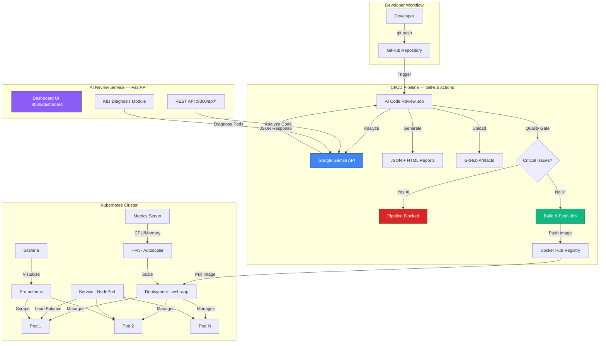
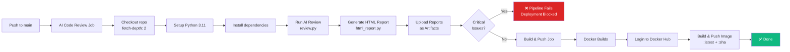
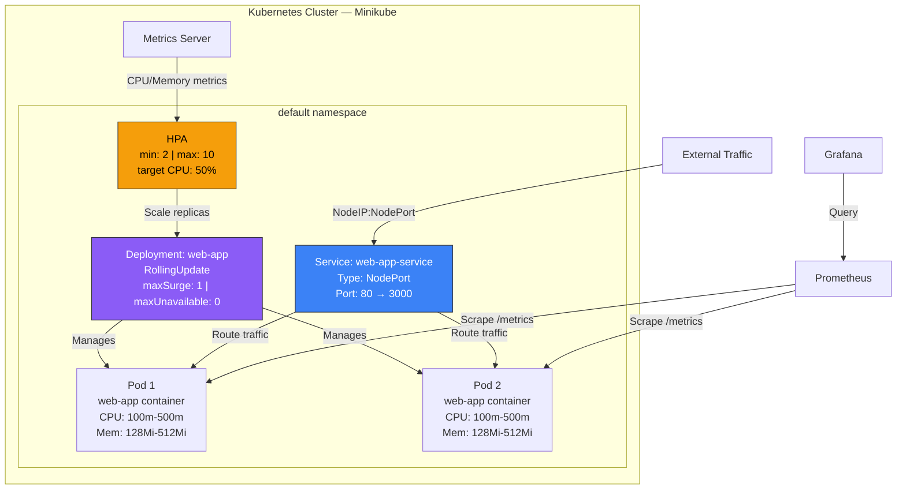

# Cloud-Native Application with AI Code Review

A production-ready, cloud-native application featuring a Dockerized Node.js service deployed on Kubernetes, with AI-powered code review and Kubernetes diagnosis powered by Google Gemini.

## 🏗️ Architecture Overview



## 📂 Project Structure

```
cloud-native-app/
│
├── app/                              # Node.js application
│   ├── server.js                     # Express server with health & stress routes
│   ├── package.json                  # Node.js dependencies
│   ├── Dockerfile                    # Multi-stage production Docker build
│   └── .dockerignore
│
├── k8s/                              # Kubernetes manifests
│   ├── deployment.yaml               # Deployment with probes & resource limits
│   ├── service.yaml                  # NodePort Service
│   └── hpa.yaml                      # Horizontal Pod Autoscaler
│
├── ai-review/                        # AI Code Review service
│   ├── app.py                        # FastAPI application & dashboard
│   ├── review.py                     # AI review engine (Gemini integration)
│   ├── prompt.py                     # Engineered prompts for code review & K8s
│   ├── github_diff.py                # Git diff utilities
│   ├── html_report.py                # Professional HTML report generator
│   ├── k8s_diagnosis.py              # AI Kubernetes pod diagnosis
│   ├── models.py                     # Pydantic data models
│   ├── logger.py                     # Centralized logging configuration
│   ├── list_models.py                # Gemini model listing utility
│   ├── requirements.txt              # Python dependencies
│   ├── .env.example                  # Environment variable template
│   ├── .gitignore
│   ├── templates/
│   │   └── dashboard.html            # Interactive dashboard UI
│   ├── reports/                      # Generated reports (gitignored)
│   └── logs/                         # Application logs (gitignored)
│
├── .github/workflows/
│   └── deploy.yml                    # CI/CD: AI Review → Build → Push
│
├── requirements.txt                  # Root Python dependencies (venv)
├── LICENSE
└── README.md
```

## 🔄 CI/CD Pipeline



## ☸️ Kubernetes Architecture



## 🚀 Quick Start

### Prerequisites

- Docker & Docker Hub account
- Minikube + kubectl
- Python 3.11+
- [Google Gemini API Key](https://aistudio.google.com/apikey)

### 1. Clone & Configure

```bash
git clone https://github.com/itsvishwasj/cloud-native-app.git
cd cloud-native-app

# Configure AI Review
cd ai-review
cp .env.example .env
# Edit .env and add your GEMINI_API_KEY
```

### 2. Install Python Dependencies

```bash
# From ai-review/ directory
python -m venv venv
source venv/bin/activate  # or venv\Scripts\activate on Windows
pip install -r requirements.txt
```

### 3. Run AI Code Review Locally

```bash
# Review changed files
python review.py

# Generate HTML report
python html_report.py

# Open the report
open reports/report.html  # or xdg-open on Linux
```

### 4. Start the Dashboard

```bash
uvicorn app:app --host 0.0.0.0 --port 8000 --reload
# Open http://localhost:8000/dashboard
```

### 5. Deploy to Kubernetes

```bash
# Start Minikube
minikube start
minikube addons enable metrics-server

# Deploy
kubectl apply -f k8s/deployment.yaml
kubectl apply -f k8s/service.yaml
kubectl apply -f k8s/hpa.yaml

# Access the app
minikube service web-app-service

# Check status
kubectl get pods
kubectl get hpa
```

### 6. AI Kubernetes Diagnosis

```bash
# Diagnose a specific pod
python k8s_diagnosis.py <pod-name> [namespace]

# Example:
python k8s_diagnosis.py web-app-7d4b8c6f9-abc12 default
```

### 7. Test HPA Autoscaling

```bash
# Get the service URL
SERVICE_URL=$(minikube service web-app-service --url)

# Trigger CPU stress
curl "$SERVICE_URL/stress?duration=10000"

# Watch pods scale
kubectl get hpa -w
kubectl get pods -w
```

## 🔑 GitHub Secrets Configuration

Add these secrets to your GitHub repository (**Settings → Secrets and variables → Actions**):

| Secret | Required | Description |
|--------|----------|-------------|
| `GEMINI_API_KEY` | ✅ | Google Gemini API key for AI code review |
| `DOCKERHUB_USERNAME` | ✅ | Docker Hub username |
| `DOCKERHUB_TOKEN` | ✅ | Docker Hub access token |

## 📡 API Reference

### Health & Status

| Endpoint | Method | Description |
|----------|--------|-------------|
| `/` | GET | Basic service status |
| `/health` | GET | Detailed health check with dependency status |

### Dashboard

| Endpoint | Method | Description |
|----------|--------|-------------|
| `/dashboard` | GET | Interactive web dashboard |

### Code Review

| Endpoint | Method | Description |
|----------|--------|-------------|
| `/api/review` | POST | Trigger AI code review on changed files |
| `/api/latest-report` | GET | Get latest consolidated review report |
| `/api/reports` | GET | List all available reports |
| `/api/reports/{name}` | GET | Get a specific report (JSON or HTML) |

### Kubernetes Diagnosis

| Endpoint | Method | Description |
|----------|--------|-------------|
| `/api/k8s/diagnose` | POST | Diagnose a pod failure from kubectl output |

#### K8s Diagnosis Request Body

```json
{
  "pod_name": "web-app-7d4b8c6f9-abc12",
  "namespace": "default",
  "logs": "<output from kubectl logs>",
  "describe": "<output from kubectl describe pod>"
}
```

## 🤖 AI Review Detection Categories

The AI code review analyzes every changed file for:

| Category | Detects |
|----------|---------|
| **Logic Bugs** | Wrong conditions, off-by-one, missing edge cases |
| **Runtime Bugs** | Null pointers, unhandled exceptions, type errors |
| **Security** | Injection, XSS, hardcoded secrets, weak crypto |
| **Performance** | N+1 queries, blocking I/O, memory leaks |
| **Kubernetes** | Missing limits, no probes, insecure RBAC |
| **CI/CD** | Missing build steps, hardcoded secrets in workflows |
| **Code Smells** | Dead code, complexity, poor naming |
| **Best Practices** | Missing types, no validation, deprecated APIs |

### Severity Levels

| Level | Impact | CI/CD Action |
|-------|--------|-------------|
| 🔴 **Critical** | Production outage / security breach | **Blocks deployment** |
| 🟠 **High** | Significant bug or vulnerability | Warning in report |
| 🟡 **Medium** | Moderate issue, non-urgent | Logged in report |
| 🟢 **Low** | Minor improvement / style | Logged in report |

## 🔧 AI Kubernetes Diagnosis

The K8s diagnosis module detects and suggests fixes for:

| Failure | What It Detects |
|---------|-----------------|
| **CrashLoopBackOff** | Missing env vars, port conflicts, dependency errors |
| **ImagePullBackOff** | Wrong image name/tag, registry auth issues |
| **OOMKilled** | Memory limits too low, memory leaks |
| **Probe Failures** | Wrong path/port, slow startup |
| **Volume Errors** | PVC not bound, permission issues |
| **Network Issues** | DNS failures, NetworkPolicy blocks |

## 📊 Monitoring Stack

| Tool | Purpose |
|------|---------|
| **Prometheus** | Metrics collection & alerting |
| **Grafana** | Metrics visualization dashboards |
| **Metrics Server** | Kubernetes resource metrics for HPA |

## 📄 License

This project is licensed under the MIT License — see the [LICENSE](LICENSE) file for details.
